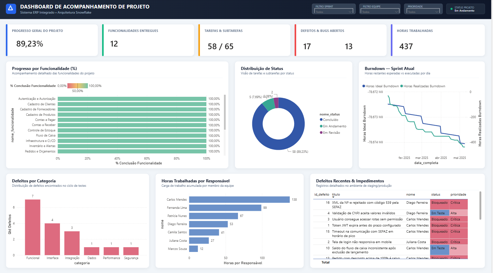
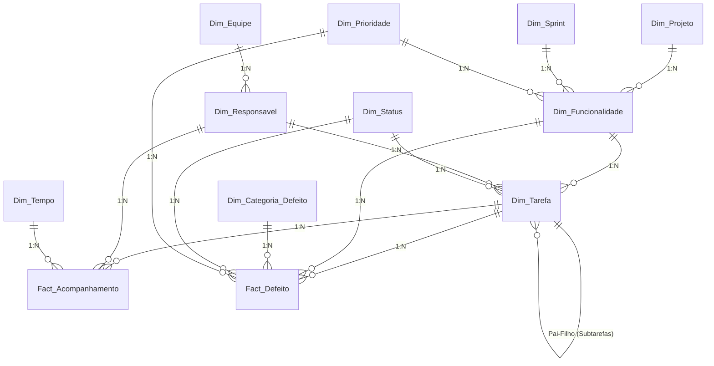

# 📊 Dashboard de Acompanhamento de Projetos — Power BI & Snowflake Architecture

> ⚠️ **Aviso Importante:** Todos os dados, métricas e informações contidos neste projeto são **100% fictícios**. Este repositório foi desenvolvido estritamente para uso pessoal, fins de estudo e composição de portfólio profissional.

Um dashboard completo e interativo desenvolvido em **Power BI** utilizando uma arquitetura multidimensional **Snowflake Schema** para o acompanhamento gerencial e operacional de desenvolvimento de software (Projeto: *Sistema ERP Integrado*).

O projeto contempla a gestão de **funcionalidades, tarefas, subtarefas, horas estimadas vs. executadas, velocidade de sprint (burndown) e rastreamento de bugs/defeitos com métricas de qualidade**.

---

## 📸 Interface do Dashboard

O layout foi desenhado com princípios modernos de **UI/UX corporativo**, apresentando uma estrutura fluida em **Tema Claro** e suporte a plano de fundo vetorial customizado (SVG).

---

## 🏗️ Arquitetura Snowflake (Data Warehouse)

A modelagem de dados adota a arquitetura **Snowflake Schema**, permitindo a normalização de dimensões secundárias (como *Sprint*, *Prioridade*, *Equipe* e *Categoria de Defeito*) conectadas às dimensões primárias (*Funcionalidades*, *Tarefas*, *Responsáveis*) e centralizadas nas duas tabelas fato do negócio.

---

## 📁 Dicionário de Dados (.CSV)

O repositório disponibiliza 12 arquivos no formato `.csv` estruturados e populados com dados fictícios e consistentes:

| Arquivo | Tipo de Tabela | Registros | Descrição |
|---|---|---|---|
| 🟢 `Dim_Projeto.csv` | Dimensão Raiz | 1 | Dados do projeto principal |
| 🟢 `Dim_Sprint.csv` | Dimensão Nível 2 | 12 | Planejamento e status das Sprints |
| 🟢 `Dim_Prioridade.csv` | Dimensão Nível 2 | 4 | Níveis de prioridade (Crítica, Alta, Média, Baixa) |
| 🟢 `Dim_Equipe.csv` | Dimensão Nível 2 | 5 | Equipes (Backend, Frontend, QA, DevOps, UX) |
| 🟢 `Dim_Categoria_Defeito.csv` | Dimensão Nível 2 | 7 | Categorias de bugs (Funcional, Segurança, etc.) |
| 🟢 `Dim_Funcionalidade.csv` | Dimensão Nível 1 | 19 | Módulos e epic features do sistema |
| 🟢 `Dim_Responsavel.csv` | Dimensão Nível 1 | 12 | Membros da equipe de desenvolvimento |
| 🟢 `Dim_Status.csv` | Dimensão Nível 1 | 8 | Fluxo de status (Backlog, Em Andamento, Concluído, etc.) |
| 🟢 `Dim_Tarefa.csv` | Dimensão Central | 65 | Tarefas e subtarefas com hierarquia |
| 🟢 `Dim_Tempo.csv` | Dimensão Calendário | 87 | Tabela dTempo com atributo de dias úteis |
| 🔴 `Fact_Acompanhamento.csv` | **Fato Principal** | 68 | Registro diário de horas trabalhadas e progresso |
| 🔴 `Fact_Defeito.csv` | **Fato Secundário** | 17 | Registro de defeitos/bugs e tempo de resolução |

---

## ⚡ Medidas DAX e Atualização em Massa

O projeto possui um arquivo automatizado de consulta DAX para **criação de todas as 21 medidas em massa** via a guia **DAX Query View** do Power BI Desktop:

📄 `medidas_consulta_dax.dax`

### Principais Indicadores Calculados:

- **Progresso Geral (%)**: `%` de tarefas finalizadas sobre o escopo total.
- **Burndown de Sprint**: Linha ideal vs. horas restantes realizadas dia a dia.
- **Consumo de Orçamento de Horas**: Horas executadas vs. estimadas.
- **Taxa de Resolução de Defeitos**: `%` de bugs corrigidos vs. abertos.
- **Tempo Médio de Resolução**: Média de horas necessárias para solução de defeitos.
- **Color Format Dinâmico**: Regra de cores customizadas aplicadas diretamente às barras e visuais.

---

## 🚀 Como Replicar o Projeto no Power BI

### 1. Obter os Dados
Baixe os arquivos `.csv` deste repositório e coloque-os em uma pasta local.

### 2. Importar no Power BI Desktop
1. Abra o **Power BI Desktop**.
2. Clique em **Página Inicial ➔ Obter Dados ➔ Texto/CSV**.
3. Importe todos os 12 arquivos `.csv`.

### 3. Aplicar o Plano de Fundo (Canvas Background)
1. Clique em uma área vazia da tela do relatório.
2. Acesse o painel **Formatar página do relatório** ➔ **Plano de fundo da tela**.
3. Em **Imagem**, escolha o arquivo `dashboard_background_light.svg`.
4. Defina o **Ajuste da Imagem** para `Ajustar` e **Transparência** para `0%`.

### 4. Criar as Medidas DAX em Massa
1. Crie uma tabela vazia no Power BI chamada `medidas`.
2. Acesse a aba **Exibição de Consulta DAX** no menu lateral do Power BI Desktop.
3. Copie o conteúdo do arquivo `medidas_consulta_dax.dax` e cole no editor.
4. Clique em **Executar** e depois em **"Atualizar modelo com alterações"**.

---

## 🛠️ Tecnologias Utilizadas

- **Power BI Desktop** (Visualização e Inteligência de Negócios)
- **DAX (Data Analysis Expressions)** (Métricas e Cálculos de Negócio)
- **Snowflake Schema Architecture** (Modelagem de Dados Multidimensional)
- **SVG / Vector Design** (Design de Interface e Canvas Background)

---

## 👤 Autor

Desenvolvido por **Lucas Pontes**  
Portfólio de Business Intelligence e Engenharia de Dados.

